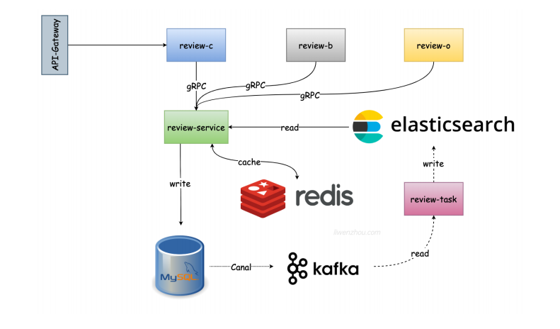

# 电商评价微服务系统

学习性质项目

基于 Kratos 的电商评价系统，围绕「写入、审核、检索、异步处理」构建了完整的微服务链路，适用于中小型电商场景的评价业务落地。



## 项目概览

本仓库是一个多服务工程，包含评价核心服务、业务处理服务、运营服务以及异步任务服务。

- `review-service`：评价核心服务（评论主流程与数据落库）
- `review-b`：业务处理服务（业务侧评价能力）
- `review-o`：运营管理服务（运营后台相关能力）
- `review-job`：异步任务服务（消费消息并写入检索系统）

## 技术栈

- 微服务框架：Kratos
- 接口协议：gRPC + Protobuf + HTTP Gateway
- 数据存储：MySQL（GORM）
- 缓存：Redis
- 消息队列：Kafka
- 检索：Elasticsearch
- 服务注册与发现：Consul
- 代码组织：CQRS 思路（读写职责分离）

## 核心能力

- 评论创建、查询与状态流转
- 评论回复与业务扩展处理
- 审核与申诉流程支撑
- 消息驱动的异步处理链路
- Elasticsearch 检索写入与查询支持

## 目录结构

```text
.
├── review-service/   # 核心评价服务
├── review-b/         # 业务处理服务
├── review-o/         # 运营管理服务
├── review-job/       # 后台任务服务
└── README.md
```

## 快速开始

### 1) 环境准备

建议本地先准备以下依赖：

- Go 1.20+
- Protobuf / protoc
- MySQL
- Redis
- Kafka
- Elasticsearch
- Consul

可选工具：

```bash
go install github.com/go-kratos/kratos/cmd/kratos/v2@latest
go install github.com/google/wire/cmd/wire@latest
```

### 2) 配置文件

请按环境修改各服务配置：

- `review-service/configs/config.yaml`
- `review-b/configs/config.yaml`
- `review-o/configs/config.yaml`
- `review-job/configs/config.yaml`

若使用服务注册，还需检查 `review-service/configs/registry.yaml`。

### 3) 安装依赖与生成代码

每个服务目录都提供 `Makefile`，可独立执行：

```bash
cd review-service
make init
make all
```

其他服务同理（`review-b`、`review-o`、`review-job`）。

### 4) 启动服务

示例（以 `review-service` 为例）：

```bash
cd review-service
go run ./cmd/review-service -conf ./configs
```

其余服务请在各自目录执行对应 `cmd/<service-name>` 启动命令。

## API 文档

- 在线文档（ApiFox）：<https://3ps7nm81x9.apifox.cn>
- 本地 OpenAPI 文件：
  - `review-service/openapi.yaml`
  - `review-b/openapi.yaml`
  - `review-o/openapi.yaml`
  - `review-job/openapi.yaml`

## 开发建议

- 新增接口优先修改 `api/**/*.proto`，再生成代码
- 保持服务内分层一致（`biz` / `data` / `service`）
- 异步链路变更时，同步检查 `review-job` 消费逻辑

## 注意事项

- 本项目依赖多个外部基础设施，建议先完成本地环境编排再联调
- 配置文件中请勿提交真实密钥与生产凭据
- 生产部署前请补齐监控、告警与链路追踪配置
